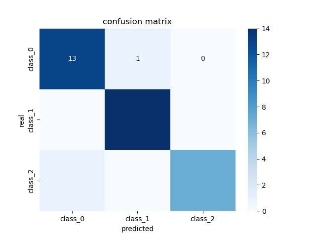
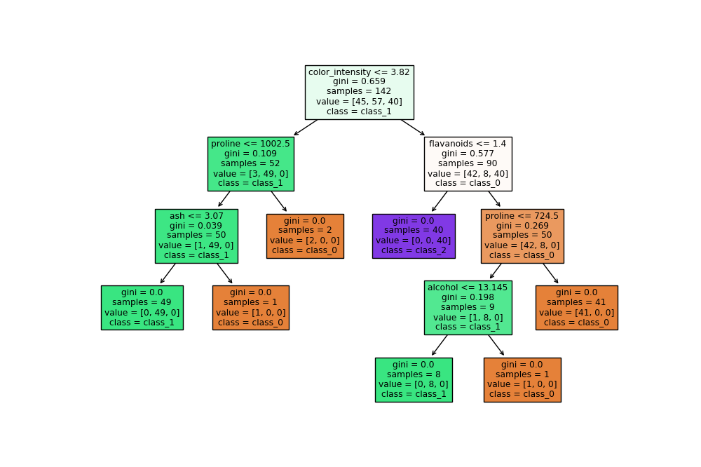

# Decision Tree Classifier with Wine Dataset

## Intro
This repository contains a Python script that how to build and evaluate a decision tree classifier using the Wine dataset. The goal is to classify wine samples into different classes based on their chemical properties. The script is very simple and open to improvement with different techniques such as; cross-validation, hyperparameter tuning, etc.

## Setup
To run the script, first set up your Python environment with the necessary libraries (pandas, scikit-learn, matplotlib, seaborn)

## Usage
Run the script with:
```
python simple_decision_tree.py
```

## Results
The script evaluates the model performance using accuracy, classification report, and confusion matrix. The following visualizations are generated and saved in the repository:

- **Confusion Matrix**: 

- **Decision Tree Visualization**: 

## References
- [Scikit-learn Documentation](https://scikit-learn.org/stable/user_guide.html)
- [Wine Dataset](https://archive.ics.uci.edu/ml/datasets/wine)


